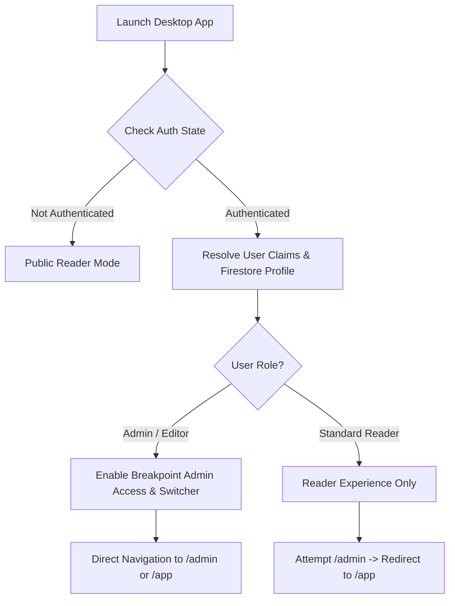

# Unified Authentication & Role-Based Routing

## 1. Overview
Breakpoint Desktop features a single, unified authentication architecture serving both public readers and administrative staff. Users authenticate once via Firebase Auth; the system dynamically resolves authorization and mounts the appropriate workspace.

## 2. Authentication Flow

## 3. Role Resolution Strategy
Roles are resolved via a defense-in-depth model in `src/contexts/AuthContext.tsx`:
1. **Firebase ID Token Custom Claims**: `tokenResult.claims.admin === true` or `tokenResult.claims.role === 'admin' | 'editor'`
2. **Firestore Authoritative Record**: `users/{uid}.role` verified against allowed roles (`admin`, `editor`, `creator`, `author`, `moderator`)
3. **Security Invariant**: Email string patterns alone NEVER grant admin access. Authorization strictly requires valid cryptographically signed claims or database records.

## 4. Route Protection
- **`AdminRouteGuard`**: Wraps `/admin/*`. Unauthenticated users or non-admin readers are redirected to `/app`.
- **Workspace Navigation**:
  - `/admin`: Breakpoint Admin workspace
  - `/app`: Breakpoint Reader workspace
  - `/`: Default redirect to `/app`
