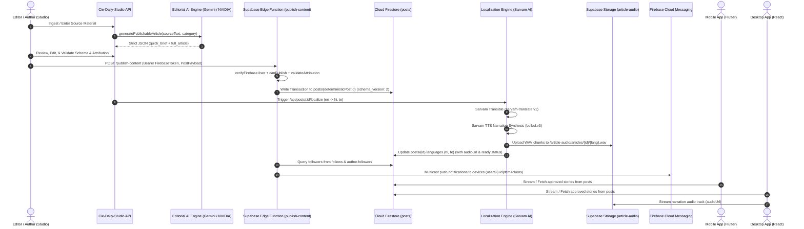

# Breakpoint Content Pipeline

> **End-to-End Content Lifecycle, Editorial Transformation, Localization, Narration, & Distribution**
> **Source Base**: `C:\Users\Public\New67\` (`Cie-Daily-Studio`, `supabase/functions`, `app`)

---

## 1. Content Pipeline Overview

The Breakpoint content pipeline transforms raw technology journalism and breaking developments into structured, localized, audio-narrated story packages consumed concurrently across Mobile (Flutter), Desktop (React/Electron), and Web (Studio).

---

## 2. Pipeline Stages in Detail

### Stage 1: Ingestion & AI Editorial Structuring
- **Entry Point**: `Cie-Daily-Studio/server.ts` (`/api/generate-article`)
- **Engine**: Gemini 2.5 Flash / NVIDIA NIM (`meta/muse-glimmer-30b`)
- **System Prompt**: Enforces strict editorial neutrality, numerical veracity, and outputs strict Schema v2 JSON containing:
  - `quick_brief`: `category`, `headline`, `quick_summary` (35–60 words), `three_things_to_know` (3 items), `key_number` (`{value, label}`).
  - `full_article`: `headline`, `hook`, `in_20_seconds`, `what_happened` (60+ words), `why_this_matters` (50+ words), `bigger_picture`, `key_stats`, `explore_sections` (2–6 items), `takeaways` (3–5 items), `quote`.

### Stage 2: Editorial Review & Validation Gate
- **Source**: `Cie-Daily-Studio/src/lib/article-contract.ts`
- **Validation Rules**:
  - `validateArticle`: Enforces minimum word counts (Quick summary ≥ 20 words, Hook ≥ 8 words, What happened ≥ 30 words, Total article ≥ 180 words, 3 takeaways, 3 key things).
  - `validateAttribution`: Verifies source type (`external`, `original`, `press_release`, `official_source`, `aggregated`), valid publication timestamp, and valid HTTP/HTTPS original URL for external content.

### Stage 3: Publishing & Firestore Persistence
- **Source**: `supabase/functions/publish-content/index.ts`
- **Function**: `publish-content`
- **Operation**:
  - Authenticates creator via Firebase ID token.
  - Generates deterministic document ID: `sha256("content:" + user.uid + ":" + clientContentId)`.
  - Executes Firestore transaction writing to `posts/{postId}` with `schema_version: 2`, `status: "approved"`, `likesCount: 0`, `commentsCount: 0`, and `createdAt: serverTimestamp()`.

### Stage 3.5: Story Identification & Thread Attachment
- **Source**: `src/services/storyMatchingService.ts`, `src/services/storyThreadService.ts`
- **Operation**:
  - Extracts typed entities, event predicates, and informative lexical tokens from the published article.
  - Queries active story candidates in the ±45 day publication window with overlapping entity sets.
  - Scores candidates via multi-signal formula (Entity 35%, Lexical 35%, Event 20%, Temporal 10%).
  - Enforces non-merge safeguards (suppresses entity-only matches with low lexical alignment to $\le 0.45$).
  - Decision:
    - **Score $\ge 0.75$**: Auto-attaches article to existing `stories/{storyId}` and sets `posts/{postId}.storyId`.
    - **Score $< 0.75$**: Seeds a new canonical story thread `stories/{newStoryId}` with `leadArticleId = postId`.

### Stage 3.6: Canonical Knowledge Enrichment & Trails Matching
- **Source**: `src/services/canonicalEntityService.ts`, `src/services/canonicalConceptService.ts`, `src/services/knowledgeTrailService.ts`
- **Operation**:
  - Extracts canonical entities from article content (`title`, `what_happened`, `why_this_matters`) using guarded string normalization with word-boundary checks (`\b`).
  - Extracts canonical concepts and validates them against neutral, non-circular domain taxonomies.
  - Matches relevant sequential **Knowledge Trails** (3 to 6 ordered steps) that elevate background understanding of the story's core concepts.
  - Generates contextual concept explanations detailing *"Why this concept matters in this specific story"*.
  - Optionally links `posts/{postId}.entityIds`, `posts/{postId}.conceptIds`, and `stories/{storyId}.conceptIds`.

### Stage 4: Localization & Audio Narration Generation
- **Source**: `Cie-Daily-Studio/src/lib/localization.ts`
- **Supported Languages**: English (`en-IN`), Hindi (`hi-IN`), Telugu (`te-IN`).
- **Translation**: Translates `headline`, `quick_summary`, `what_happened`, `why_this_matters`, and `explore_sections` using Sarvam Translate (`sarvam-translate:v1`).
- **TTS Synthesis**: Synthesizes combined narration script using Sarvam AI `bulbul:v3`.
- **Storage Upload**: Assembles PCM WAV audio and uploads to Supabase Storage bucket `article-audio` at path `articles/{articleId}/{language}.wav`.
- **Firestore Update**: Writes localized text, translation readiness, and public audio URL to `posts/{postId}.languages.{hi, te}`.

### Stage 5: Follower Notification Dispatch
- **Source**: `supabase/functions/_shared/notifications.ts`
- **Audience Resolution**: Queries `follows.where("followingId", "==", authorUid)` and `author.followers`.
- **FCM Delivery**: Resolves recipient device tokens from `users/{uid}/fcmTokens`, filters by user notification preferences (`followerAllowsNotification`), and dispatches high-priority pushes on channel `cie_daily_messages`.

### Stage 6: Client Experience Consumption
- **Flutter Mobile App**: Queries `posts` where `category != 'Reel'` and `status in ['approved', 'published']`, parsing optional `storyId`, `entityIds`, and `conceptIds`, rendering Quick Brief decks, deep-dive views, and contextual knowledge graphs.
- **Desktop Application**: Queries `posts`, `stories`, `entities`, `concepts`, and `knowledgeTrails` with real-time Firestore listeners, mapping Schema v2 records into rich reading panes, audio narration, interactive `CONCEPTS` tabs, inline concept modals, and sequential Knowledge Trail walkthroughs.

